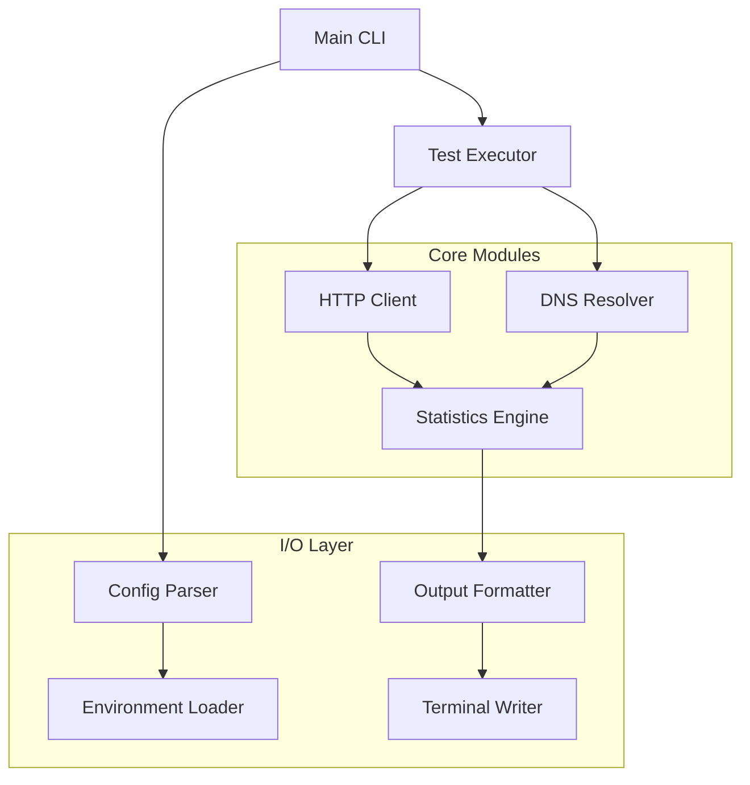

# Design Document

## Overview

The Rust implementation of the network latency tester will be a high-performance, cross-platform command-line application that replaces the existing bash script with modern, maintainable code. The design emphasizes modularity, type safety, and concurrent execution while preserving all existing functionality and adding environment-based configuration.

The application will use async/await patterns for efficient network operations, structured configuration management, and a plugin-based architecture for different DNS providers and output formatters.

## Steering Document Alignment

### Technical Standards (tech.md)
Since no tech.md exists, we'll follow Rust best practices:
- Use cargo workspace for organized module structure
- Follow Rust API guidelines and naming conventions
- Implement proper error handling with Result types
- Use async/await for network operations
- Apply zero-cost abstractions where possible

### Project Structure (structure.md)
Since no structure.md exists, we'll implement a clean modular architecture:
- Separate concerns into distinct modules
- Use traits for extensibility and testing
- Implement configuration as code patterns
- Follow standard Rust project layout

## Code Reuse Analysis

### Existing Components to Leverage
- **HTTP Client Patterns**: The bash script's curl usage patterns will inform our HTTP client design
- **DNS Configuration Logic**: The DNS server and DoH provider configuration approach will be preserved
- **Statistical Calculations**: The mathematical operations for average, min, max, and standard deviation will be implemented with higher precision
- **Output Formatting**: The color-coded table format will be recreated with better terminal handling

### Integration Points
- **.env Configuration**: New integration point for environment-based configuration
- **System DNS**: Integration with system resolver as fallback
- **Terminal Output**: Enhanced terminal handling for colors and formatting
- **Cross-platform Support**: Integration with platform-specific network APIs

## Architecture

The application follows a layered architecture with clear separation between configuration, execution, analysis, and presentation:

### Modular Design Principles
- **Single File Responsibility**: Each module handles one aspect (config, networking, stats, output)
- **Component Isolation**: HTTP client, DNS resolver, and statistics calculator as separate concerns
- **Service Layer Separation**: Configuration parsing, test execution, data analysis, and output formatting
- **Utility Modularity**: Shared utilities for error handling, validation, and formatting



## Components and Interfaces

### Configuration Module (`src/config.rs`)
- **Purpose:** Parse command-line arguments, load .env files, validate configuration
- **Interfaces:** 
  ```rust
  pub struct Config {
      pub target_urls: Vec<String>,
      pub dns_servers: Vec<String>,
      pub doh_providers: Vec<String>,
      pub test_count: u32,
      pub timeout: Duration,
      pub enable_color: bool,
      pub verbose: bool,
      pub debug: bool,
  }
  
  pub fn load_config() -> Result<Config, ConfigError>
  pub fn merge_env_config(config: &mut Config) -> Result<(), ConfigError>
  ```
- **Dependencies:** clap for CLI parsing, dotenv for .env files
- **Reuses:** Preserves all configuration options from bash script

### HTTP Client Module (`src/client.rs`)
- **Purpose:** Execute HTTP requests with detailed timing measurements
- **Interfaces:**
  ```rust
  pub struct TimingMetrics {
      pub dns_time: Duration,
      pub connect_time: Duration,
      pub first_byte_time: Duration,
      pub total_time: Duration,
      pub http_status: u16,
  }
  
  #[async_trait]
  pub trait HttpClient {
      async fn request_with_timing(&self, url: &str, dns_config: &DnsConfig) -> Result<TimingMetrics, ClientError>;
  }
  
  pub struct ReqwestClient;
  impl HttpClient for ReqwestClient { ... }
  ```
- **Dependencies:** reqwest for HTTP, tokio for async runtime
- **Reuses:** Timing measurement approach from curl implementation

### DNS Configuration Module (`src/dns.rs`)
- **Purpose:** Manage different DNS provider configurations and validation
- **Interfaces:**
  ```rust
  #[derive(Debug, Clone)]
  pub enum DnsConfig {
      System,
      Custom { servers: Vec<IpAddr> },
      DoH { url: String },
  }
  
  pub fn validate_dns_config(config: &DnsConfig) -> Result<(), DnsError>
  pub fn create_dns_configs(
      custom_servers: &[String], 
      doh_providers: &[String]
  ) -> Result<Vec<DnsConfig>, DnsError>
  ```
- **Dependencies:** trust-dns-resolver for DNS operations
- **Reuses:** DNS server and DoH provider configuration patterns

### Statistics Engine (`src/stats.rs`)
- **Purpose:** Calculate statistical metrics from timing measurements
- **Interfaces:**
  ```rust
  #[derive(Debug)]
  pub struct Statistics {
      pub mean: f64,
      pub min: f64,
      pub max: f64,
      pub std_dev: f64,
      pub success_rate: f64,
  }
  
  pub fn calculate_stats(timings: &[Duration]) -> Statistics
  pub fn format_timing_ms(duration: Duration) -> String
  ```
- **Dependencies:** Standard library mathematical functions
- **Reuses:** Statistical calculation approach from bash script with higher precision

### Test Executor Module (`src/executor.rs`)
- **Purpose:** Orchestrate test execution across configurations with concurrency
- **Interfaces:**
  ```rust
  #[derive(Debug)]
  pub struct TestResult {
      pub config_name: String,
      pub dns_config: DnsConfig,
      pub metrics: Vec<Option<TimingMetrics>>,
      pub statistics: Statistics,
  }
  
  pub struct TestExecutor {
      client: Box<dyn HttpClient>,
      config: Config,
  }
  
  impl TestExecutor {
      pub async fn run_all_tests(&self, url: &str) -> Result<Vec<TestResult>, ExecutorError>
      pub async fn run_single_config(&self, url: &str, dns_config: &DnsConfig, name: &str) -> Result<TestResult, ExecutorError>
  }
  ```
- **Dependencies:** futures for concurrent execution
- **Reuses:** Test iteration and configuration testing patterns

### Output Formatter Module (`src/output.rs`)
- **Purpose:** Format and display results with color coding and tables
- **Interfaces:**
  ```rust
  pub trait OutputFormatter {
      fn format_header(&self) -> String;
      fn format_test_result(&self, result: &TestResult) -> String;
      fn format_summary(&self, results: &[TestResult]) -> String;
  }
  
  pub struct ColoredFormatter {
      enable_color: bool,
  }
  
  pub struct PlainFormatter;
  
  impl OutputFormatter for ColoredFormatter { ... }
  impl OutputFormatter for PlainFormatter { ... }
  ```
- **Dependencies:** colored for terminal colors, comfy-table for formatting
- **Reuses:** Color scheme and table layout from bash script

### Diagnostics Module (`src/diagnostics.rs`)
- **Purpose:** Perform network connectivity diagnostics before main testing
- **Interfaces:**
  ```rust
  pub struct DiagnosticResult {
      pub test_name: String,
      pub success: bool,
      pub message: String,
  }
  
  pub async fn run_diagnostics(client: &dyn HttpClient) -> Vec<DiagnosticResult>
  pub async fn test_basic_connectivity(client: &dyn HttpClient) -> DiagnosticResult
  pub async fn test_https_connectivity(client: &dyn HttpClient) -> DiagnosticResult
  pub async fn test_dns_resolution(client: &dyn HttpClient) -> DiagnosticResult
  ```
- **Dependencies:** HTTP client interface
- **Reuses:** Diagnostic test patterns and connectivity checks

## Data Models

### Configuration Model
```rust
#[derive(Debug, Clone, Deserialize)]
pub struct Config {
    // CLI and environment configuration
    pub target_urls: Vec<String>,           // TARGET_URLS env var
    pub dns_servers: Vec<String>,           // DNS_SERVERS env var  
    pub doh_providers: Vec<String>,         // DOH_PROVIDERS env var
    pub test_count: u32,                    // TEST_COUNT env var
    pub timeout_seconds: u64,               // TIMEOUT_SECONDS env var
    pub enable_color: bool,                 // ENABLE_COLOR env var
    pub verbose: bool,                      // CLI only
    pub debug: bool,                        // CLI only
    pub custom_url: Option<String>,         // CLI only
}
```

### Timing Metrics Model
```rust
#[derive(Debug, Clone)]
pub struct TimingMetrics {
    pub dns_resolution: Duration,           // Time for DNS lookup
    pub tcp_connection: Duration,           // Time to establish TCP connection
    pub tls_handshake: Option<Duration>,    // TLS handshake time (HTTPS only)
    pub first_byte: Duration,               // Time to receive first byte
    pub total_duration: Duration,           // Total request time
    pub http_status: u16,                   // HTTP response status code
    pub success: bool,                      // Whether request succeeded
}
```

### Test Results Model
```rust
#[derive(Debug)]
pub struct TestResult {
    pub config_name: String,               // Human-readable config name
    pub dns_config: DnsConfig,             // DNS configuration used
    pub url: String,                       // Target URL tested
    pub individual_results: Vec<Option<TimingMetrics>>, // Per-iteration results
    pub statistics: Statistics,            // Calculated statistics
    pub success_count: u32,                // Number of successful requests
    pub total_count: u32,                  // Total requests attempted
}
```

### Statistics Model
```rust
#[derive(Debug)]
pub struct Statistics {
    pub dns_avg: f64,                      // Average DNS resolution time (ms)
    pub connect_avg: f64,                  // Average connection time (ms)  
    pub first_byte_avg: f64,               // Average first byte time (ms)
    pub total_avg: f64,                    // Average total time (ms)
    pub dns_min: f64,                      // Minimum DNS time (ms)
    pub dns_max: f64,                      // Maximum DNS time (ms)
    pub total_min: f64,                    // Minimum total time (ms)
    pub total_max: f64,                    // Maximum total time (ms)
    pub std_deviation: f64,                // Standard deviation of total times
    pub success_rate: f64,                 // Success percentage (0.0-100.0)
}
```

## Error Handling

### Error Scenarios
1. **Network Connectivity Errors:**
   - **Handling:** Wrap in custom `NetworkError` enum, retry logic for temporary failures
   - **User Impact:** Clear error messages with suggested troubleshooting steps

2. **DNS Resolution Failures:**
   - **Handling:** Fallback to system DNS, continue with other configurations
   - **User Impact:** Skip failed DNS config with warning, show partial results

3. **Configuration Validation Errors:**
   - **Handling:** Early validation with detailed error context using `anyhow`
   - **User Impact:** Clear error messages indicating which configuration is invalid

4. **HTTP Client Errors:**
   - **Handling:** Categorize errors (timeout, connection refused, TLS, etc.)
   - **User Impact:** Specific error messages, suggestions for firewall/proxy issues

5. **Environment File Parsing Errors:**
   - **Handling:** Graceful fallback to default configuration with warnings
   - **User Impact:** Warning about ignored invalid .env entries, continue execution

### Error Type Hierarchy
```rust
#[derive(Debug, thiserror::Error)]
pub enum AppError {
    #[error("Configuration error: {0}")]
    Config(#[from] ConfigError),
    
    #[error("Network error: {0}")]
    Network(#[from] NetworkError),
    
    #[error("DNS error: {0}")]
    Dns(#[from] DnsError),
    
    #[error("Statistics calculation error: {0}")]
    Statistics(String),
}

#[derive(Debug, thiserror::Error)]
pub enum ConfigError {
    #[error("Invalid URL: {url}")]
    InvalidUrl { url: String },
    
    #[error("Invalid timeout value: {value}")]
    InvalidTimeout { value: String },
    
    #[error("Environment file error: {0}")]
    EnvFile(#[from] dotenv::Error),
}

#[derive(Debug, thiserror::Error)]
pub enum NetworkError {
    #[error("Request timeout after {timeout}s")]
    Timeout { timeout: u64 },
    
    #[error("Connection refused to {url}")]
    ConnectionRefused { url: String },
    
    #[error("DNS resolution failed for {domain}")]
    DnsResolution { domain: String },
    
    #[error("HTTP client error: {0}")]
    HttpClient(#[from] reqwest::Error),
}
```

## Testing Strategy

### Unit Testing
- **Configuration Module:** Test .env parsing, CLI argument validation, configuration merging
- **Statistics Engine:** Test mathematical calculations with edge cases (empty data, single values)
- **DNS Configuration:** Test validation of DNS servers and DoH URLs
- **Output Formatter:** Test color coding logic, table formatting, edge case handling
- **Error Handling:** Test error propagation and user-friendly message generation

### Integration Testing
- **HTTP Client Integration:** Test against local test servers with controlled responses
- **DNS Resolution:** Test with mock DNS servers and DoH endpoints
- **End-to-End Configuration:** Test complete configuration loading from files and CLI
- **Cross-platform Behavior:** Test on different operating systems for consistent behavior
- **Performance Testing:** Benchmark against bash script for regression testing

### End-to-End Testing
- **Complete Workflow:** Test full execution cycle from configuration to output
- **Error Scenarios:** Test graceful handling of network failures, invalid configurations
- **Real Network Testing:** Integration tests against actual public DNS providers
- **CLI Integration:** Test all command-line options and their interactions
- **Environment Configuration:** Test various .env file configurations and overrides

### Test Infrastructure
```rust
// Mock HTTP client for testing
pub struct MockHttpClient {
    responses: HashMap<String, Result<TimingMetrics, NetworkError>>,
}

// Test utilities
pub fn create_test_config() -> Config { ... }
pub fn create_mock_timing_metrics() -> TimingMetrics { ... }
pub async fn run_integration_test(config: Config) -> Result<Vec<TestResult>, AppError> { ... }

// Property-based testing for statistics
#[cfg(test)]
mod property_tests {
    use proptest::prelude::*;
    
    proptest! {
        #[test]
        fn statistics_calculation_properties(timings in prop::collection::vec(0u64..10000, 1..100)) {
            let stats = calculate_stats(&timings.into_iter().map(Duration::from_millis).collect::<Vec<_>>());
            assert!(stats.min <= stats.mean);
            assert!(stats.mean <= stats.max);
            assert!(stats.success_rate >= 0.0 && stats.success_rate <= 100.0);
        }
    }
}
```

### Performance Considerations
- **Concurrent Execution:** Test different DNS configurations concurrently where possible
- **Memory Efficiency:** Stream results rather than buffering all timing data
- **CPU Usage:** Optimize statistical calculations for large iteration counts  
- **Startup Time:** Minimize initialization overhead for quick execution
- **Binary Size:** Use feature flags to exclude unused functionality

### Cross-platform Compatibility
- **Windows:** Test with Windows DNS resolution and networking stack
- **macOS:** Test with system keychain integration if needed for certificates
- **Linux:** Test with various distributions and DNS configurations
- **Container Environments:** Test behavior in Docker containers with limited networking